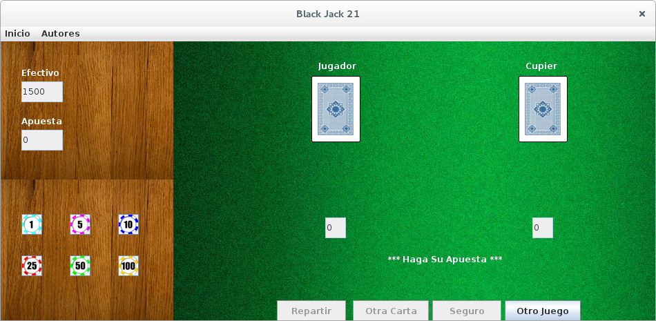
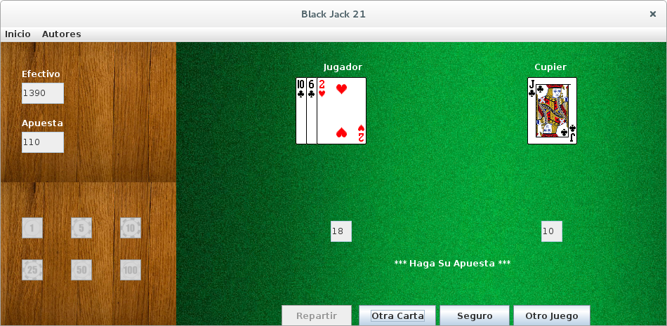
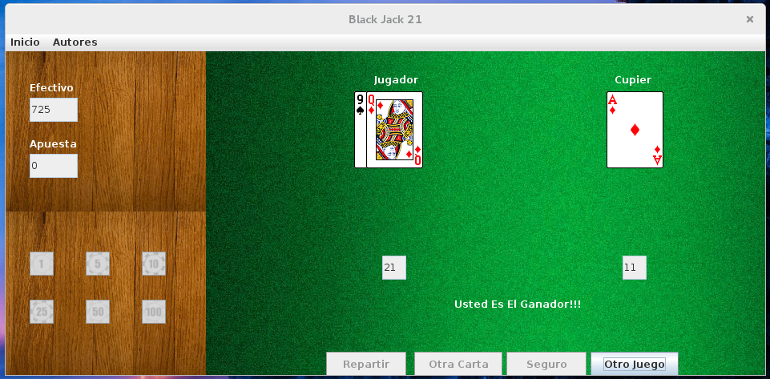
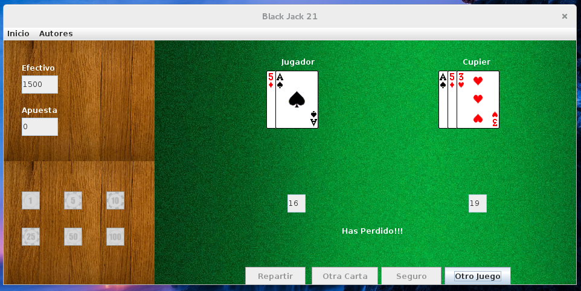

# 21 Black Jack

El objetivo es que el Jugador logre sumar 21 puntos o acercarse más que el Cupier a dicha cantidad.
El juego se inicia repartiendo tres cartas destapadas de manera alterna entre el Jugador y el Cupier.
La primera y la tercera carta son para el jugador, la segunda para el Cupier.

### Screenshots

